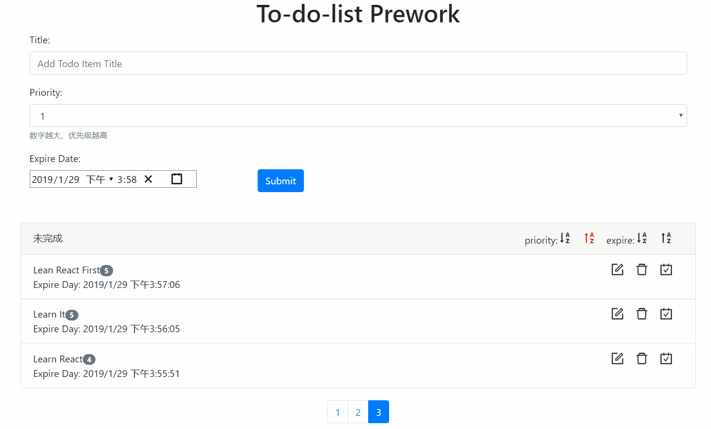

This project was bootstrapped with [Create React App](https://github.com/facebook/create-react-app).

## 成果截图

* 增加一个代办事项 

* 删除一个代办事项

* 标记一个待办事项为已完成

* 编辑一个待办事项的具体内容

* 列表界面支持翻页

* 支持按照不同的方式排序，如优先级，expire date

## 部署

* 后端
docker化

* 前端
本地build后上传到阿里云，配置nginx

## 项目预览

http://hysite.xin/